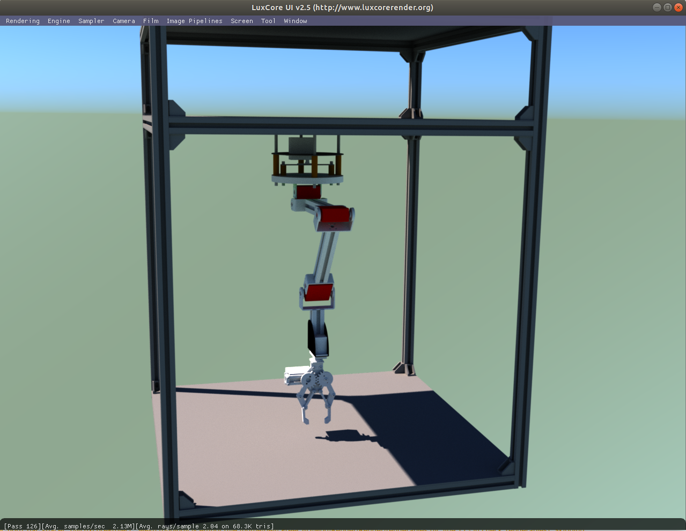
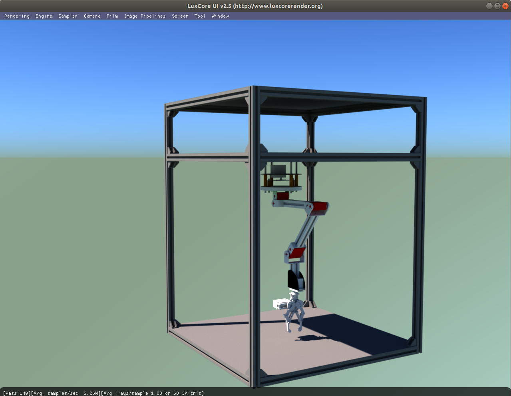

# MR. COFFEE - robotic arm

    
    

## Table of contents

* [General info](#general-info)
* [Technologies](#technologies)
* [Hardware](#hardware)

## General info

MR. COFFEE will be a internet connected chess-playing robot. It'll allow users to play in human-machine mode (my custom UCI engine) or human-human mode, where robot serves as a remote hand for connected player. Build thread on twitter is a simple tech blog. After release of final verison of robot, I'll write an article and post full codebase. 
 
Build thread: https://twitter.com/kamil_kurach/status/1475853391540723722

## Technologies

## Hardware
