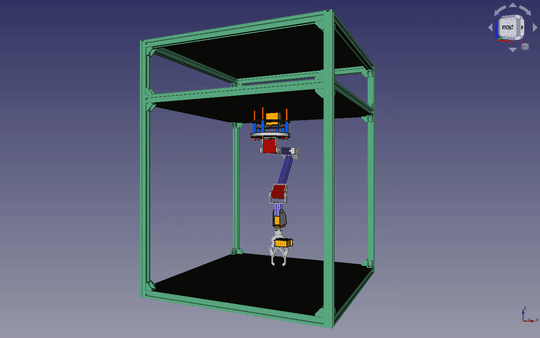

# MR. COFFEE - robotic arm

||

||

## Table of contents

* [General info](#general-info)
* [Build thread on Twitter](#build-thread-on-twitter)
* [Technologies](#technologies)
* [Hardware](#hardware)

## General info

MR. COFFEE will be a internet connected chess-playing robot. It'll allow users to play in human-machine mode (my custom UCI engine) or human-human mode, where robot serves as a remote hand for connected player. Build thread on twitter is a simple tech blog. After release of final verison of robot, I'll write an article and post full codebase. 

## Build thread on Twitter

<html lang="en">

<blockquote class="twitter-tweet">
<a href="https://twitter.com/hashtag/robotics?src=hash&amp;ref_src=twsrc%5Etfw">#robotics</a> There is some sort of special feeling when you combine hardware with software and it starts to move. <a href="https://t.co/OUUlQEHs6o">pic.twitter.com/OUUlQEHs6o</a>
&mdash; Kamil Kurach (@kamil_kurach) <a href="https://twitter.com/kamil_kurach/status/1475853391540723722?ref_src=twsrc%5Etfw">December 28, 2021</a></blockquote> 

</html>
 
## Technologies

## Hardware
